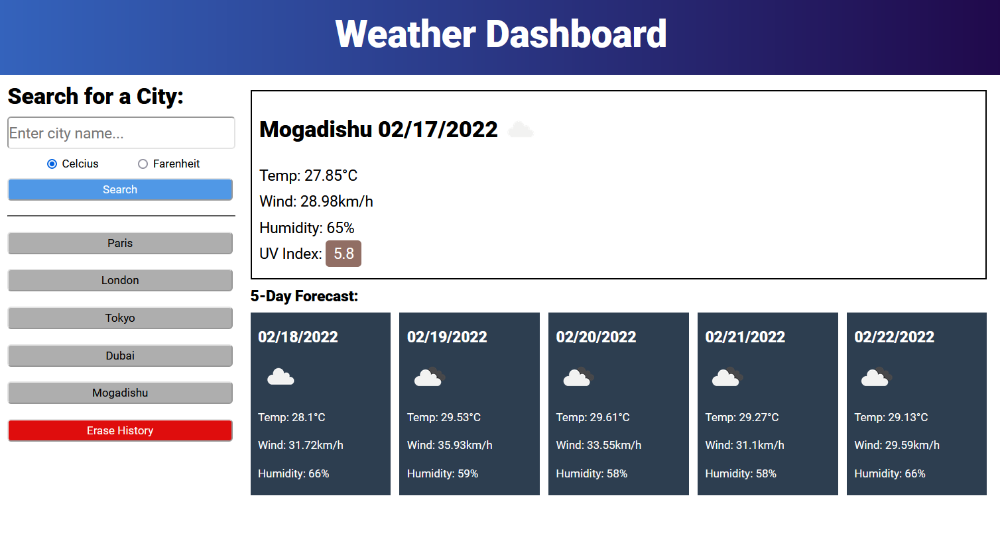

# weatherDash

This program presents a basic weather app. 
A user may enter a city, and select units, to see the present weather and a five-day forecast. 
Each search is added to a history, allowing the user to click on a button to retrieve the weather for that location.  
 
   
 Please find the deployed program at the link below: 
<a href="https://nialvo.github.io/weatherDash/">Weather Dashboard</a>
  
 For all inquiries, please email me via the link below: 
 <a href = "mailto: pilibili@protonmail.com">Send Email</a> 
